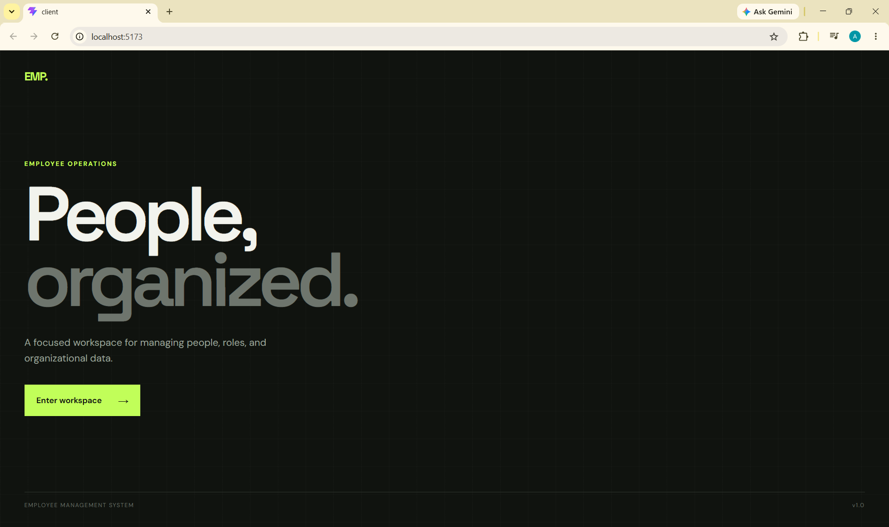
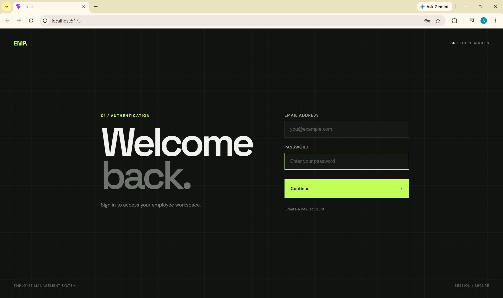
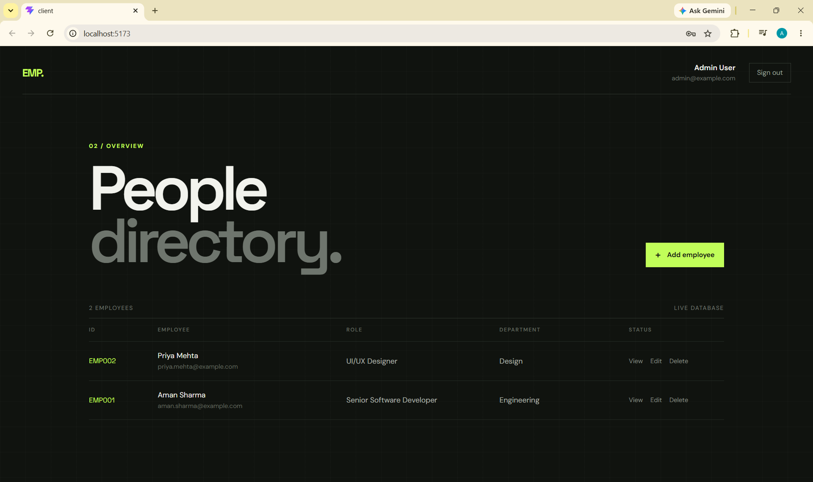
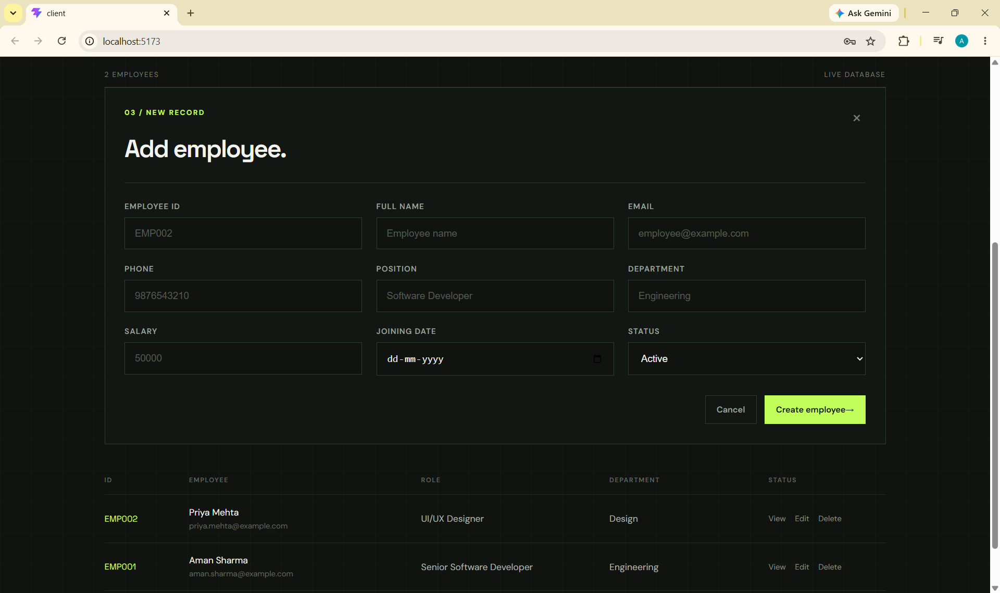
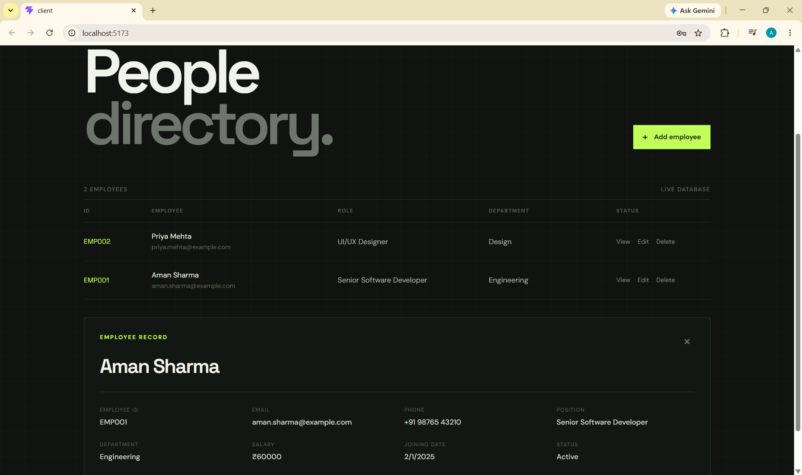
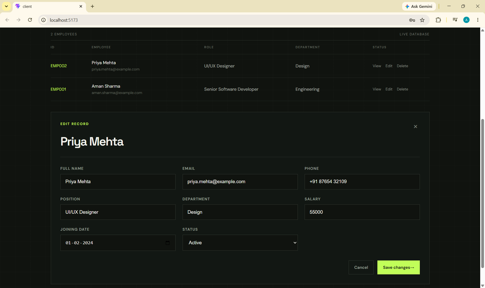

# PRODIGY_WD_02 — Employee Management System

A full-stack Employee Management System developed as part of my Full-Stack Web Development Internship at Prodigy InfoTech.

## Features

* User registration and login
* Secure password hashing with bcrypt
* JWT-based authentication
* HTTP-only authentication cookies
* Persistent login session
* Protected employee API routes
* Create employees
* View employee details
* Edit employee information
* Delete employees
* MongoDB database integration
* Input validation
* Responsive and modern dashboard UI
* Logout functionality

## Tech Stack

### Frontend

* React
* Vite
* JavaScript
* CSS

### Backend

* Node.js
* Express.js
* MongoDB
* Mongoose
* bcryptjs
* JSON Web Token
* cookie-parser
* CORS
* dotenv

## Project Structure

```text
PRODIGY_WD_02/
│
├── client/
│   ├── public/
│   └── src/
│
├── server/
│   ├── config/
│   ├── controllers/
│   ├── middleware/
│   ├── models/
│   ├── routes/
│   └── server.js
│
├── screenshots/
│   ├── 01-landing.png
│   ├── 02-login.png
│   ├── 03-dashboard.png
│   ├── 04-add-employee.png
│   ├── 05-employee-details.png
│   └── 06-edit-employee.png
│
├── .gitignore
└── README.md
```

## Screenshots

The following screenshots demonstrate the application's user interface and main employee management features.

### 1. Landing Page



### 2. Sign In



### 3. Employee Dashboard



### 4. Add Employee



### 5. Employee Details



### 6. Edit Employee


